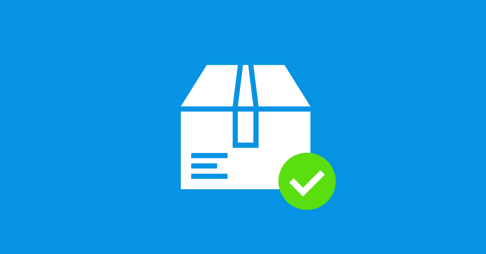
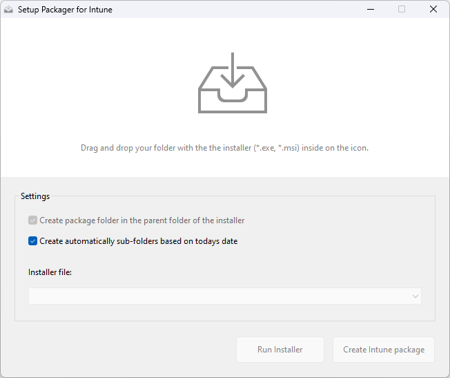

# SetupPackagerIntune

<!-- ABOUT THE PROJECT -->
## About The Project
This application helps you to package your setup files for Intune faster and easier with the official Win32 Content Prep Tool, without entering any commands manually in the console:  

<!-- GETTING STARTED -->
## Getting Started

### Prerequisites
Install PowerShell Module "IntuneWin32App" by MSEndpointMgr for Intune Upload:
https://github.com/MSEndpointMgr/IntuneWin32App

### Installation
You can download the latest release via GitHub or use the MSI install from the "Installer" folder.

<!-- USAGE EXAMPLES -->
## Usage

**How to video:** 
https://blog.tugi.ch/scripts-and-tools/setup-packager-for-intune

 

1. Create the folder structure for app packaging - My recommandation:
- **Software Packages**
- **Software Packages / 7-zip 22.01 x64** (main folder)
- **Software Packages / 7-zip 22.01 x64** / Installer (which contains the installer of the app, *.exe or *.msi)
- **Software Packages / 7-zip 22.01 x64** / Package (for the package file / *.intunewin)
- **Software Packages / 7-zip 22.01 x64** / Documentations (for documentations etc.)
2. Run the app `SetupPackager.exe` and drag & drop your installer folder (e.g. Software Packages / 7-zip 22.01 x64 / Installer) from Windows Explorer to the upload icon.
3. Select the installer file in the dropdown field - EXE, MSI or installer script
4. Click on `Create Intune package`
 

<!-- LICENSE -->
## License
Distributed under the MIT License. See `LICENSE.txt` for more information.

<!-- CREDITS -->
## Credits
[MSEndpointMgr/IntuneWin32App](https://github.com/MSEndpointMgr/IntuneWin32App)

<!-- CONTACT -->
## Contact
TUGI - [contact@tugi.ch](mailto:contact@tugi.ch) 
Project Link: [https://blog.tugi.ch/scripts-and-tools/setup-packager-for-intune](https://blog.tugi.ch/scripts-and-tools/setup-packager-for-intune)
